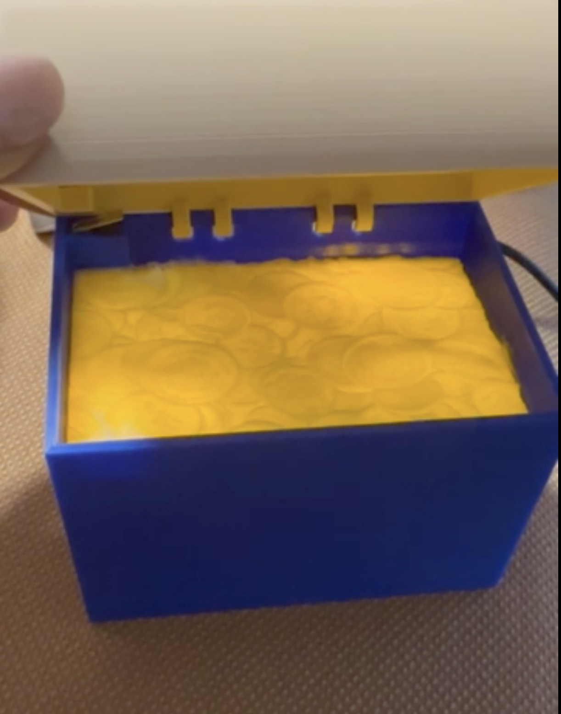

# RoAE23
Malene Rolsted Christensens logbog

Robotter og Automatisering

Valgfag med Tobias Grundtvig

Datamatiker 4. semester

Efterår 2023

# Tirsdag den 22. august 2023 - First Blink
Vi fik udleveret en NodeMCU 1.0 (ESP-12E Module) og satte vores første projekt op vha af Platform IO i VSCode. Vi har i fællesskab skrevet kode, der får de små indbyggede dioder i nodeMCU’en til at blinke på skift ved brug af delay (som ellers på længere sigt er no go, da det standser alt andet kode i at blive eksekveret samtidig). Til næste gang skal der skaffes kabel og testes at opsætningen virker efter hensigten, når NodeMCU'en modtager koden samt strøm via computeren.

https://www.make-it.ca/nodemcu-details-specifications/

# Fredag den 25. august 2023 - First Blink / Traffic Light
Vi fik undervisning i hvordan et kredsløb fungerer ift volt, ohm og amperer, og vi udvidede koden (First Blink) fra sidst til at den nu kan få 6 eksterne dioder til at lyse på skift - dog stadig ved brug af delay. Vores opgave til næste gang er nu at vi skal lave halvandet lyskryds (der er ikke udgange nok på NodeMCU'en til to hele lyskryds), og de skal køre forskudt af hinanden. Derudover skal der ikke bruges delay længere, men states.

# Mandag den 28. august 2023 - Traffic Light
I dag har vi lavet vores halvandet trafiklys. Tobias havde tegnet de 8 states der dækkes i et trafiklys-loop, og dem fik vi kodet ind og tildelt de relevante dioder. Der var en mindre udfordring mht brugen af konstruktoren til lyskrydset, da vi netop ikke kunen lave to fulde lyskryds med 2 x 6 dioder (1 rød, 1 gul, 1 grøn til øst/vest-retningen og det samme til nord/syd-retningen). Men kontruktoren var sat op til fulde lyskryds med 6 dioder, og derfor blev vi i tvivl om hvad vi egentlig skulle skrive ved de sidste 3 pins i lyskryds nr 2. Men ellers virker det som det skal. Vi spørger Tobias i morgen.

# Tirsdag den 29. august 2023 - Undervisning - Button
Det viste sig at løsningen på de 3 tomme pins i kontruktoren til nr. 2 trafiklys var at skrive -1 på hver af de 3 pins. Vi havde forsøg + googlet os frem til null og forsøgt med dette, hvilket jo også ville have givet mening normalvis, men åbenbart blev det i C++ læst som 0, hvilket sendte koden for de 3 sidste pins til 0, som rent faktisk er en PIN på boarded, og det var derfor at det ikke opførte sig som det skulle, når vi koblede det andet trafiklys til.

Dagens tema var nye komponenter, der kunne kobles til et kredsløb på boarded. Først legede vi med en knap, der skulle tænde for en blå diode. Vi blev undervist i den støj der ligger ifm push og release af en knap, og hvordan man koder sig udenom. Til sidst fik vi udleveret en forskellig sensor hver, som vi skal have skrevet relevant kode til til næste gang, så vi kan demonstrere sensorens funktion. Vi fik en Sonic Sensor, som kan måle afstand.

VIDEO AF TRAFFIC LIGHT

# Onsdag den 30. august 2023 - Sonic Sensor

I dag forsøgte vi at få vores Sonic Sensor til at virke. Den fungerer ved at den har en transmitter og en receiver - transmitteren sender en høj frekvens ud, lydbølgen rammer et objekt og sender bølgen tilbage, receiver modtager ekkoet og kan beregne hvor langt væk objektet er. Vi prøvede et hav af forskellige ting, vi fandt kodeeksempler på nettet der burde virke og vi var i kontakt med Tobias, der også sendte et link til kode der burde virke, men intet fik den lille sensor til at måle noget som helst. Vi ved ikke om det er fordi den ikke får strøm nok (der findes åbenbart både en version der skal bruge 5V og en version der kan klare sig med 3.3V), om vi har overset noget helt åbenlyst, eller om den simpelthen bare ikke virker.

# Torsdag den 31. august 2023 - Undervisning - Wifi Example
Tobias kiggede på sensoren i dag og kunne efter utallige forsøg heller ikke få den til at virke, så det må forblive et mysterie hvorfor det ikke kunne lade sig gøre.

# Tirsdag den 5. september 2023 - Undervisning (3D printer opsætning)
Jeg er syg..

# Torsdag den 7.  september 2023 - Undervisning (NodeMCU Cutout)
Jeg er stadig syg..

# Tirsdag den 12. september 2023 - Undervisning (Train System & Connect System)

I dag foreslog Tobias at vi fremover arbejder sammen på et fælles projekt, der lægger sig ovenpå et togsystem han tidligere har udviklet på. Det var der god stemning for, og vi gik i gang med at brainstorme på en lille mekanisme, der kan klikke to dele sammen, som for eksempel togskinnerne med svellerne. Konklusionen blev dog at den komponent Tobias allerede havde udviklet stadig var det bedste bud fremadrettet, så den fortsætter vi med i næste uge.

# Fredag den 15. september 2023 - Undervisning (Click Collect)
Vi fortsatte med clicker systemet fra sidst. Vi kiggede på, mens Tobias itererede gennem flere størrelser af den lille clicker samt det modsvarende hul, den skal kunne komme igennem. Der blev modelleret og printet.

# Tirsdag den 19. september 2023 - Undervisning (Click Collect - tight/loose)
Vi fortsatte samme set up sidst. Vi kiggede på mens Tobias kodede og printede forskellige varianter af clicker systemet. Denne gang var temaet at der skulle kunne lave både en loose og en tight samling alt efter hvad ens behov er. Længden af den lille split man stikker ind og længden af hullet kan nu også justeres efter behov. Vi fik til opgave at bruge denne version til vores egen idé til næste gang.

# Onsdag den 20. september 2023 - Toothbrush
I dag og i morgen arbejder vi på vores eget projekt, der inkluderer Tobias' Click Collect system. Jeg fik den idé at vi kunne modellere en elektrisk tandbørste, da den både gør brug af den version af clickeren han har lavet, som er loose, til drejemekanismen yderst på tandbørsten, og samtidig gør brug af den tight version af clickeren til der hvor man klikker de komponeneter sammen, der skal sidde stramt fast uden bevægelighed. Jeg har tegnet en lille tegning af min idé.

I dag designede vi så en dobbeltklikker, der kan forbinde det yderste tandbørsteled, hvor tandbørstehovedet sidder med et samlerled, hvorved vi opnår drejemekanismen, da denne klikker er loose. Vi fik indsat de runde huller vi skulle bruge fra Tobias' system i nogle små runde samleled, hvor det ene har hul hele vejen igennem, så klikkeren kan klikke videre ind i den øverste cylinder på tandbørsten, og det andet lukkes efter hullet, så man i teorien kunne lime tandbørstehår på. Vi fortsætter i morgen.

# Torsdag den 21. september 2023 - Toothbrush

I dag fik vi modelleret resten af tandbørsten minus den der skulle muliggøre at man kunne skille selv håndtaget ad vha clickerne og indsætte batterier. Der mangler i princippet selvfølgelig mange andre features, hvis alt elektronikken skulle kunne indsættes, men målet var en modellering af selve formen inkl diverse klikkere og det nåede vi frem til. Der er nu også den øverste og den nederste cylinder, som begge klikkes sammen vha tight klikkes, da der intet behov er for fleksibilitet her, det skal bare sidde sammen og bliver der.

Vi håber at vi får lov til at printe delene i morgen og forsøge at klikke det hele sammen, så vi kan se om vi har overset noget i sammensætningerne og/eller funktionaliteten.

# Fredag den 22. september 2023 - Treasure Chest & Pirates Buzzer

Vi skal nu finde på vores eget projekt, der skal vare resten af fagets tid dvs 3 uger fra nu. Der blev brainstormet i mange retninger. Jeg vendte tilbage til tidligere tanker om at prøve at undersøge potentialet i brugen af metamaterialer, men foreslog også i en helt anden retning at vi kunne prøve at lave en lille cykel. Valget faldt i sidste ende på et smykkeskrin med musik. Muligvis også med en lille drejende figur indeni ved brug af motor, men som udgangspunkt er stemningen at det er der ikke tid til, så vi starter med æsken og musikken.

# Tirsdag den 26. september 2023 - Treasure Chest & Pirates Buzzer

Mark joinede gruppen, og så gik vi to i gang med at brainstorme på hængselmekanismen til æsken. Første tanke var noget med en aflang, hul cylinder og så en meget lille cylinder igennem - meget klassisk samlingsmetode, men som regel i metal og det er jo ikke det vi vel - vi vil 3D printe det hele. Vi landede på små gribeklør i overdelen og små cylindere med huller under, der matcher placeringen af griberne, så griberne kan dreje frit rundt på cylinderne, når æsken åbnes og lukkes.

Det blev derudover besluttet at smykkeskrinet nu er en skattekiste. Der er fundet melodi fra Pirates of the Caribbean, der kan afspilles på en buzzer.

# Torsdag den 28. September 2023 - Treasure Chest & Pirates Buzzer
Jeg tog ind for at lave et par testprints af samleren (griberne og cylinderen, der skal samle æskens top og bund), så vi kan komme videre med udviklen af skattekisten. Vi eksperimenterede med at printe griberen stående med "armene" op i luften uden support, og det blev vellykket. Cylinderne til bunden, der har huller nedenunder, får support i hullerne, og det var lige til at få ud bagefter, så det fungrerer også. Den printer med blå materiale printede mest præcist, og det er vi afhængige af, når komponeneterne er så små, så der blev lavet et ekstra sæt gribere i blå. Cylinderen blev som den skulle i første go. I morgen kan vi så sætte komponenterne fast på selve æsken, så den kan printes i sin helhed.

VIDEO AF GRIP V2 PRINT

VIDEO AF CYLINDER V2 PRINT

# Fredag den 29. september 2023 - Treasure Chest & Pirates Buzzer

Jeg brugte dagen på at sætte samlemekanismen, som vi kom frem til, fast på selve kisten bund og top og derudeover blev der tilføjet cylindere i bunden, der kan tage fat i NodeMCU igennem de fire huller, den har. Her blev der brugt den bid kode Tobias havde lavet ifm NodeMCUCutout beholderen. Der blev også tilføjet et hul i æskens bagside til ledningen der forbinder NodeMCU'en med computeren. Mandag printer vi æsken samlet for første gang - det tog længere tid end ventet at intergrere løsdelene i den rigtige kiste, jeg havde ellers håbet at vi kunne nå at printe inden weekenden.

# Tirsdag den 3. oktober 2023 - Treasure Chest & Pirates Buzzer
Første samlede print af skattekisten blev lavet i dag på de gode printere. Der var en del ting, der viste sig at skulle rettes. Låget kunne ikke slide på som planlagt, fordi der ikke var nok plads ved siden af cylinderne til at et samlet gribersæt kunne klikke ned over kanten inden det kunne slides til siden ind over cylinderen. Hullet til USB ledning til NodeMCU'en lå for langt nede og var for småt. Men ved at brække lidt kanter op + et enkelt griber ben af, kunne vi for første gang mase lys og lyd ned i kisten, og få en fornemmelse af hvordan det vil blive.

Jeg brugte eftermiddagen, da jeg kom hjem på rettelser. Jeg har ændret i tykkelsen på æsken, da den var ved et uheld blevet kun 1 mm, hvilket var alt for bøjeligt - nu er den 2.5 mm. Cylinderne er blev gjort kortere, nu er de kun 1 mm mere end gribersættet i modsætning til før hvor de var 10 mm mere. Hullet til USB stikket til Node er blevet ændret til de rigtige mål. Og så har jeg også ryddet op i koden i dag, da det var blevet lidt af en rodebutik - nogle ting foregik i klasser og nogle ting i main, og det var ikke logisk hvad der lå hvor. Æsken var også vendt på hovedet ift Z-aksen, så det gjorde alle yderligere beregninger af placeringer af komponenter helt besynderlige. Nu vender alt som det skal, og i main kan man vælge mellem at viewe bunden alene, toppen alene eller begge dele samlet (selvom det selvfølgelig ikke kan printes samlet, er det meget rart at kunne tjekke at det hele passer sammen som det skal).

# Fredag den 6. oktober 2023 - Treasure Chest & Pirates Buzzer
Første lithophane med et billede af mønter blev printet i dag til den lettere smadrede æske fra igår. Der blev testet med lys og brainstormet på hvordan vi får effekten af lithopanen frem, for dioderne var slet ikke kraftfulde nok til at give den ønskede effekt. Tobias forslog om dioderne kunne kodes til at flimre, så det var mindre synligt hvor de små lyskilder er. Vi lavede låget om fra at være firkantet til at være rundet, så det samlede look mere ligner en rigtig skattekiste.

# Tirsdag den 10. oktober 2023 - Treasure Chest & Pirates Buzzer

I dag nåede vi en del, da det er sidste uge af faget, og vi skal til at have fart på, hvis vi skal nå frem til en ordentlig prototype her til sidst. Vi har været igennem virkelig mange idéer til hvor vi kan placere knappen, så den bliver trykket ned og aktiverer lyd og lys på den mest elegante måde. Vi har overvejet at sætte den i låget sammen med flere dioder og endnu et lithophane af et dødningehoved for eksempel, men det når vi ikke i denne omgang. Vi har overvejet om der skulle indgå en nøgle, som skulle kunne trykke knappen ind igennem et nøglehul i bunden. Og i dag eksperimenterede vi også kort med om vi kunne lægge knappen under lithophanen sammen med nogle fjedre (vi testede med fjedre fra kuglepenne) og så skulle noget fra låget trykke ned på lithophanen ved lukket tilstand (knappen skulle dermed bare lige kodes omvendt, så den aktiverede på release i stedet for ved push). MEN vi er nået frem til at det mest realistiske på nuværende tidspunkt er en lille knapholder i toppen af bunden og en knaptrykker i låget. Vi fik bygget en holder til knappen ind i æsken - den lille knapholder testprintede vi også 2 gange seperat, inden vi integrerede den. Knappen fik loddet ledninger på, så den bare kan slides ind gennem rillen i siden og bunden af knapholderen, og vi ikke skal bekymre os om at ledningerne falder af (de sad meget løst på). Æsken blev gjort lidt større, så der lige præcis er plads til nodeMCU i midten + 2 små boards til dioderne i bunden (1 på hver side af Node), så dioderne ikke skal ligge løst i bunden, som vi på et tidspunkt forestillede os. Der er blevet printet et større lithophane billede af mønterne til den nye størrelse æske. Og så har æsken fået kanter som møntbilledet kan ligge og hvile på. Jeg modellerede på livet løs og vendte tilbage senere på eftermiddagen, for at sætte bunden i gang i en af "de dårlige" printere. Den tager 20 timer, så hvis vi antager at den ikke bliver perfekt i første huk, skal vi udnytte nætterne til at køre testprints fra nu af. Helt impulsivt satte jeg også toppen i print i en af de andre printere, den tager 13 timer - den er mindre end bunden, men der er også sat en del support på. Jeg kommer tilbage i morgen tidlig for at se resultatet.

VIDEO AF LITHO V2 PRINT

# Onsdag den 11. oktober 2023 - Treasure Chest & Pirates Buzzer

Dagen startede med at jeg kom over på skolen for at se resultat af nattens printe-session, og det viste sig at printeren, der skulle have printet låget til kisten, havde spyttet slangen til materialet ud lige efter jeg var gået. På billedet ses den gul kistebund, der stadig er i gang med at blive printet (det var de 20 timer), og den røde kistebund, hvor den kun lige har nået at printe starten af fundamentet, og så har den ellers bare krusedullet det uopvarmede materiale ud over det hele.

Jeg havde “heldigvis” opdaget et par mangler ved den version jeg havde sat over igår, da det var en yderst forhastet process og ovenikøbet helt impulsiv også at sætte toppen i print, så der er mange rettelser lige at tilføje inden printerne sættes i gang igen. Toppen manglede knaptrykkeren, så det har jeg eksperimenteret en del med at modellere i dag, og vi landede på en version, hvor det er en kasse, der kun trykker på halvdelen af knappen (den laveste del af knappen), for at undgå at trykke det stykke metal, der stikker op fra knappen skævt. Trykkeren sidder i låget og kommer derfor fra en skæv vinkel, når låget drejer ned over, og det har vi forsøgt at tage højde for på denne måde.
Bunden manglede også hullerne under griberne, de var røget i svinget, da vi udvidede hele kisten - det bliver godt når det hele bliver refactoreret til at tage variabler i stedet for hard codede tal, så disse fjollede fejl kan undgåes. Men vi fik testet at der var plads til alt elektronikken, og der var alt lige som det skulle være og litho passede super fint i æsken. Jeg udvidede også kanterne billedet hviler på en smule, da det en enkelt gang faldt igennem.

# Torsdag den 12. oktober 2023 - Treasure Chest & Pirates Buzzer

Printet der har kørt onsdag nat er blevet rimelig perfekt på alle andre parametre end på overfladen af låget, hvor supporten desværre sad så godt fast at den rev noget af lågets overflade med af, da jeg fjernede det, mens andre dele af supporten sidder så godt fast at jeg slet ikke kan fjerne den. De er simpelthen gået i symbiose, og vi vurderer ikke at det er et printerproblem, men et support/design-problem. I dag besluttede vi så i stedet at lave et eksperiment med at printe låget 180 grader roteret, så toppen af låget vender opad. Vi har lagt support under hele underkantet i stedet, men ikke inde i rundingen i håb om at printeren lige præcis kan klare den del uden support, da den jo netop er rund. Underdelen har vi ingen problemer med længere, så den printes ikke igen. Alt fungerer ift beholderen til knappen og samlingen af over- og underdel.

# Fredag den 13. oktober 2023 - Treasure Chest & Pirates Buzzer
Der blev lavet endnu et testprint af låget. Udfordringen ligger i hvordan det printes med mindst mulig support, og alle forsøg på et godt print har slået fejl indtil videre. Nået hertil er det åbenlyst at designet simpelthen skulle have været lavet med det faktum i mente, at vi ville undgå nødvendigheden af support fuldstændig, men den erfaring er selvfølgelig kun opnået ved at løbe hovedet mod muren et antal gange, så det er nemt at være bagklog nu.

Der blev lavet en mindre ændring ift til dioderne, da de hidtil alle har kørt på samme udgang, hvilket resulterede i at lysintensiteten dalede diode for diode, og man kunne tydeligt se hvor kredsløbet begyndte og endte. Løsningen blev at fordele det over to udgange, så alle 16 nu lyser lige kraftigt.

Derudover gik vi i gang med at refactorere hele koden, så man fremover kan bruge contructoren til at instantiere en kiste på de ønskede mål fremfor at det hele sker via manuelt indtastede tal, der også skal manuelt genberegnes i hver metode for at komponenterne flyttes tilsvarende korrekt. Vi nåede at tage hul på TopChest klassen, og jeg sørger for at refactorere resten i ferien.

VIDEO AF FINAL CHEST

# Onsdag den 18. oktober 2023 - Treasure Chest & Pirates Buzzer
Jeg har arbejdet på at refactorere resten af koden, og nu er den nye version merged ind i main.

Man kan nu bruge contructoren til BottomChest klassen og TopChest klassen og instantiere en kistebund og en kistetop på et hvilket som helst givet mål. Det oprindelige firkantede låg har fået lov til at blive i koden, så man kan så vælge om man ønsker et rundt eller et firkantet låg ved instantieringen af TopChest. Alle komponenterne rykker sig relativt ift de ydre mål samt at der kastes et par exceptions, hvis der indtastes mål, der vil resultere i at komponenterne begynder at overlappe, eller hvis top og bund ikke matcher i størrelse. Det tager nu lidt længere tid at rendere i OpenSCAD, men det er klart også den mest præcis og generaliserede version af koden vi har haft indtil videre. Det har derudover været ret tilfredsstillende at forsøge at gennemtænke hver linje af koden ift hvorfor jeg havde skrevet lige præcis det tal jeg havde. Nu kører langt det meste på variabler der låser sig til en sammenhæng med de overordnede mål eller ift nogle andre komponenter der indgår, hvilket gør at sandsynligheden for fejl i beregningerne bør være minimeret.

Der er stadig mange ting man kunne overveje at forfine både i kode, design og prints, men her slutter projektet for denne gang. Jeg fik en sjov tanke om at det kunne være et bestillingsprodukt, hvor en kunde kunne plotte sine ønskede mål ind på en hjemmeside samt oploade et billede, der ville blive til lithophane printet, og så til sidst vælge en sang, og så kunne man få tilsendt sin lille æske, som var helt personlig. Nu blev vores version så til en skattekiste, men æsken og konceptet som helhed kunne jo i virkeligheden have haft et hvilket som helst tema.

